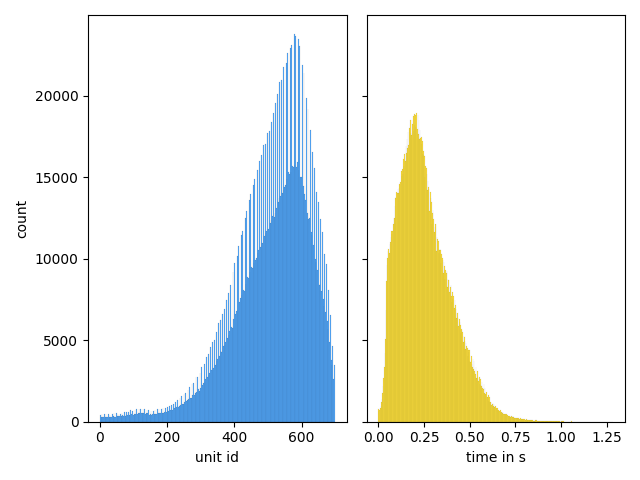
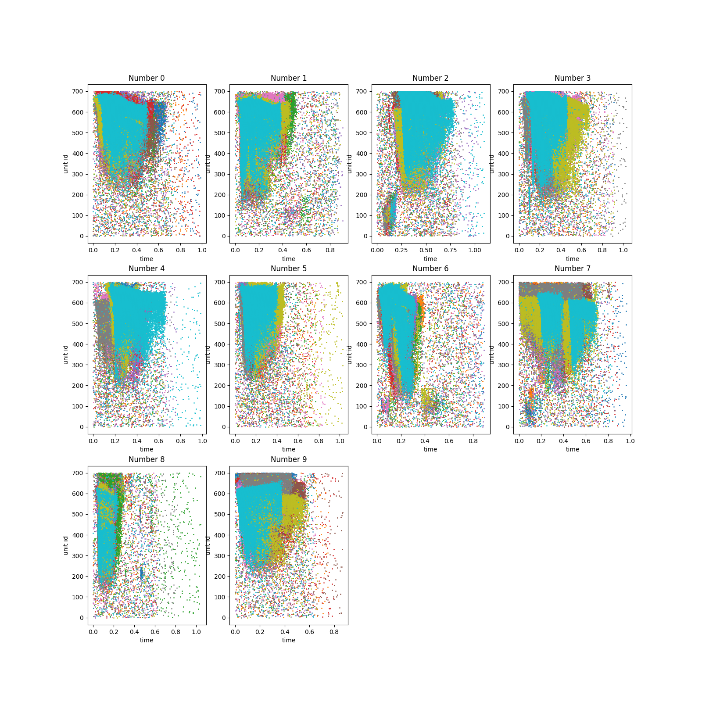
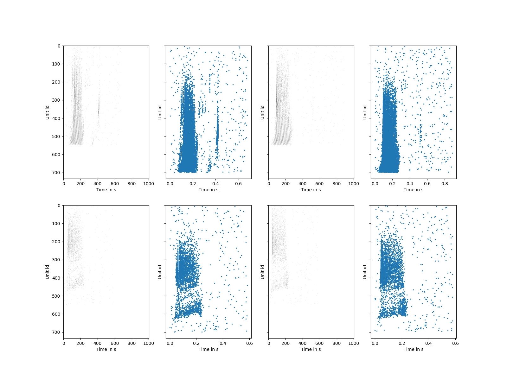
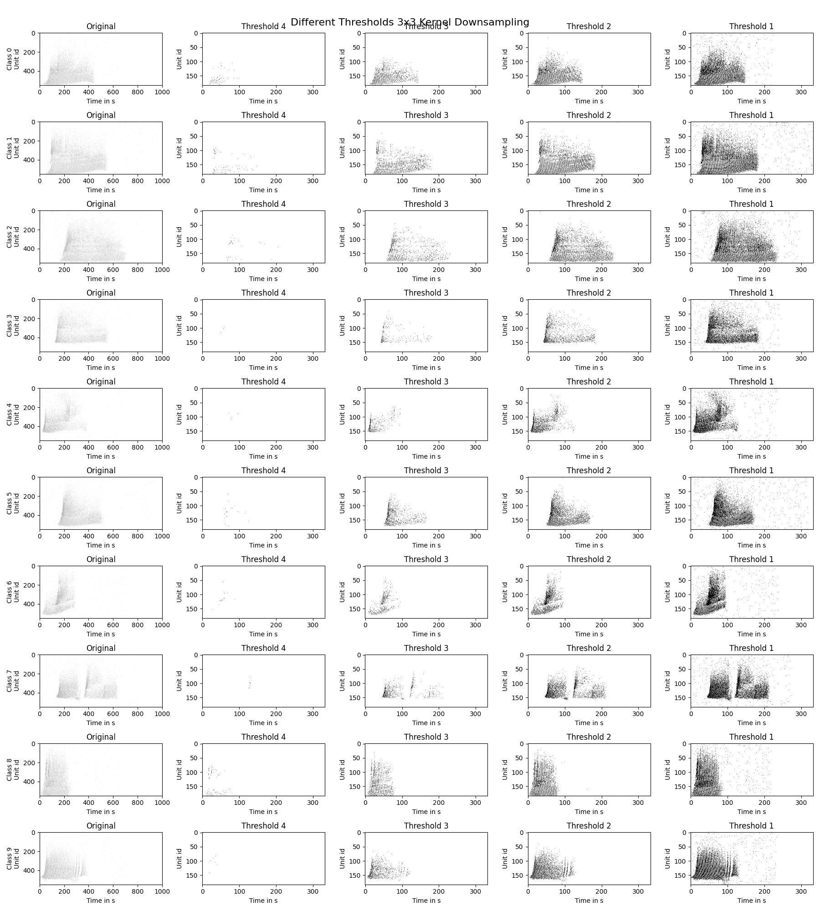

### Preprocessing the Spiking Heidelberg Digits (SHD) Dataset

### Project Goal

My goal was to take a look at the **Spiking Heidelberg Digits (SHD)** dataset and think of a good way to input it into a Spiking Neural Network.

***

### Dataset Overview

The Dataset was given in an `.h5` file. It represents spoken German and English digits as neural spikes. The raw data consists of three main components:
-   **`units`:** The sound was converted into 700 unit ids using an artifical model mimicing parts of the inner ear and the ascending auditory pathway.
-   **`times`:** The exact time in milliseconds when the spike occurred.
-   **`labels`:** The corresponding digit (0-9 for German, 10-19 for English).

The Data is has the big temporal component of what unit was triggered at what time making it a good training set for SNNs.

***

### Data Visualization

To understand the dataset I loaded the Dataset and made some Graphs for it:

1.  **Histograms:** I first created two histograms, one for the `times` data and one for the `unit` IDs.
    * **Time Histogram:** The histogram of spike times showed that the majority of spikes occurred within the first 600 milliseconds of each recording. This indicated that the later parts of the recordings contained little to no useful information and could maybe just be cut off.
    * **Unit ID Histogram:** The histogram for the unit IDs showed that the spikes were heavily concentrated in unit IDs greater than 200. This meant that the first 200 or so unit ids were rarely active. 

  

2.  **Scatter Plots:** I used some scatter plots to visualize the relationship between time and unit ID for individual samples.
    * **English Scatter Plot:** I filtered the data to show only the English digits (labels 10-19). This plot showed that for the numbers 0 to 9 in english most of the unit IDs appeared to be cluttered above 150.

  

***

### Neuron Input Problem

The main goal was also to reduce the number of necessary input neurons. At first my plan was to have one input neuron correspond to one unit id. This seemed like a good idea but with the goal of maybe turing this SNN into a circut at some point 700 were still far to many. So to reduce the number of input neurons I used a mix of simply cutting of data as well as pooling, by applying methods from image processing onto the spiking data. The main idea was to somehow reduce the number of necessary input neurons while still keeping the data high quality and the temporal component intact. 

1.  **Vectorization:** To make the data usable for an SNN and prepare it for the further processing, I converted the spike lists into a uniform format. I created a dictionary of matrices, where each key corresponded to a spoken digit. Each matrix had `unit IDs` on one axis and `time steps` on the other. I filled in the matrix with a **'1'** if a spike occurred at that specific unit ID and time, and a **'0'** otherwise. I also **cut off the first 150 unit IDs** which my visualizations showed were largely inactive.
    * **Matrix vs. Scatter Plot:** To verify that the data still resembled the original data, I created a plot that placed the matrix side-by-side with its original scatter plot. This confirmed that the conversion was succesful and that the key spike patterns were maintained.

  

2.  **Pooling:** As a final step to further reduce the number of input neurons, I applied a **pooling** to the matrices.
    * **The Kernel:** I used a 3x3 kernel to downsample the matrices. This kernel combined the activity of a small group of adjacent unit ids over a short period of time into a single new unit id. If the number of spikes within the 3x3 area exceeded a specific **threshold** the new unit id would be a 1 otherwise a 0.
    * **Testing Thresholds:** I plotted matrices with different pooling thresholds (1, 2, 3, and 4) to determine the best value. This visualization showed that a low threshold could introduce noise while a high one could lose important data. From the plots I came to the conclusion that a threshold of **2 or 3** was optimal for preserving the patterns while reducing the amount of input neurons needed.

  

In the end I managed to reduce the number of input neurons necessary down from 700 to just 183. Although to really make sure this data still resembled the original and was of high quality more testing needed to be done.
