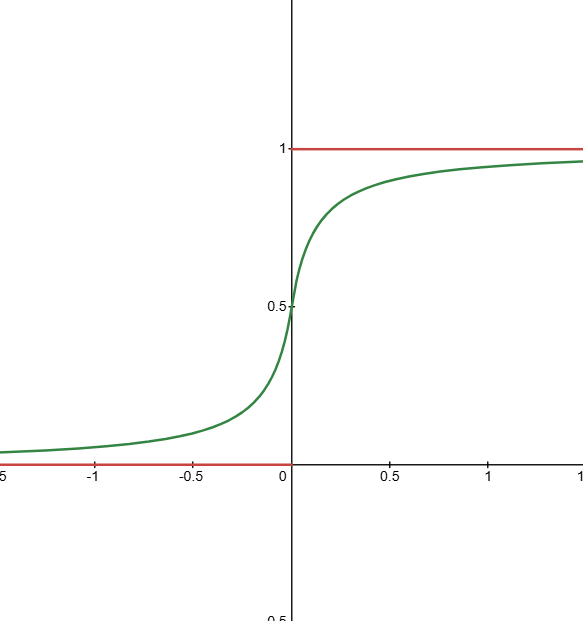
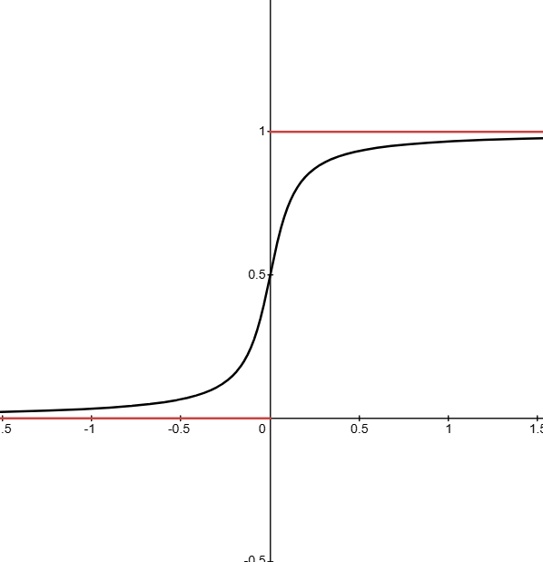
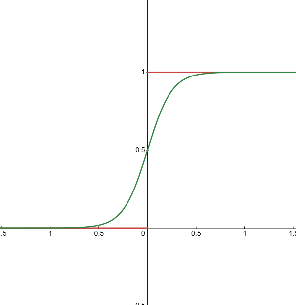
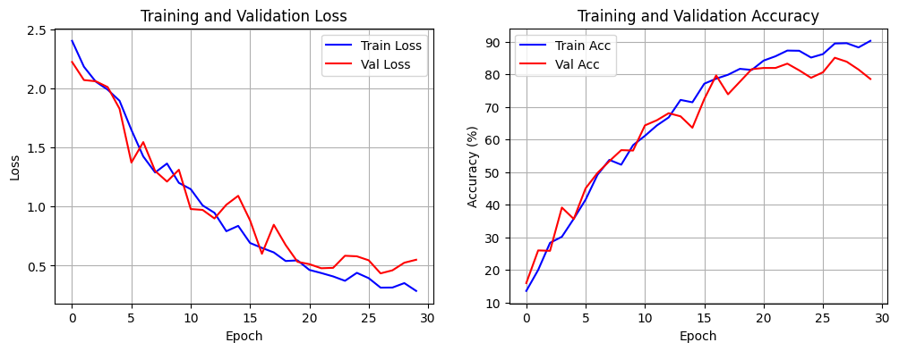
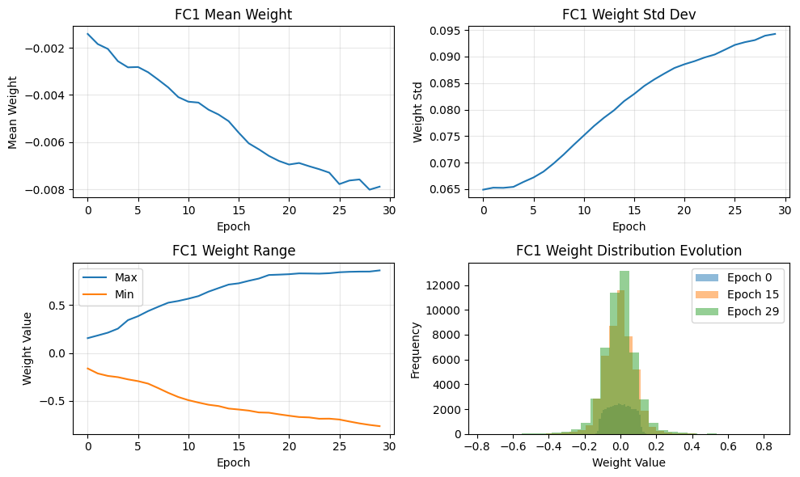
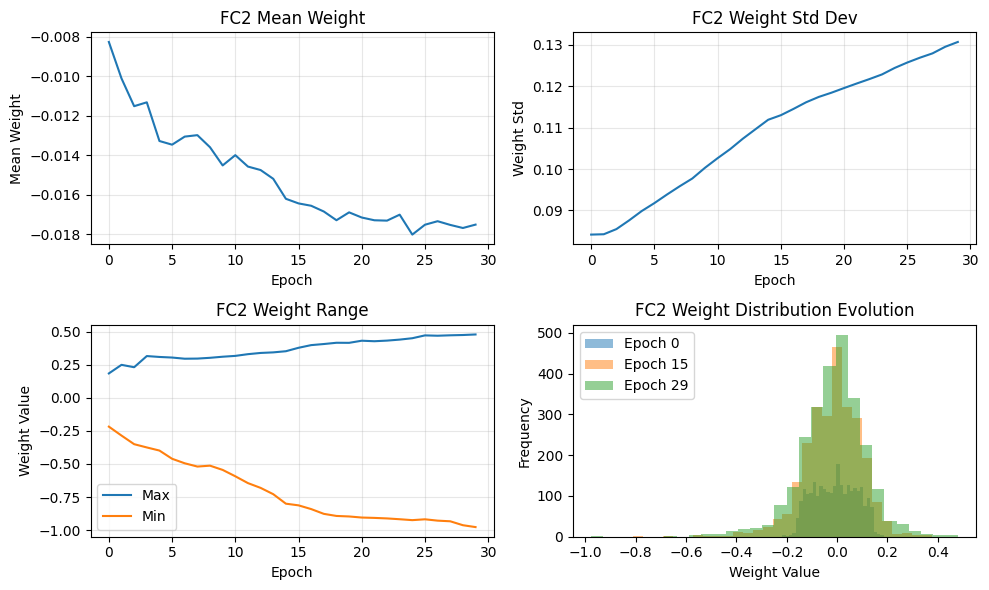
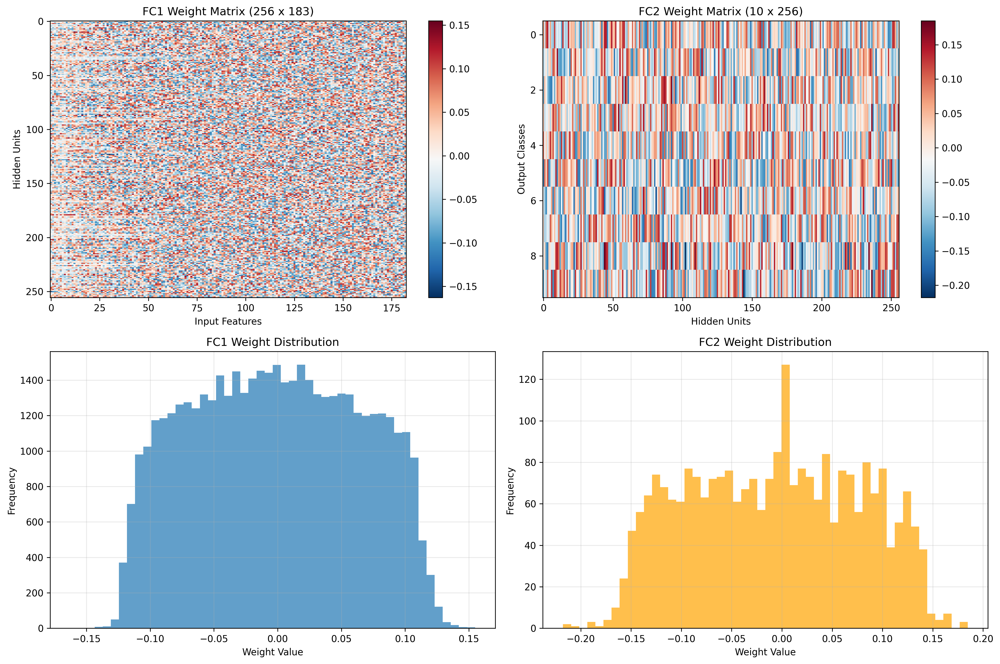
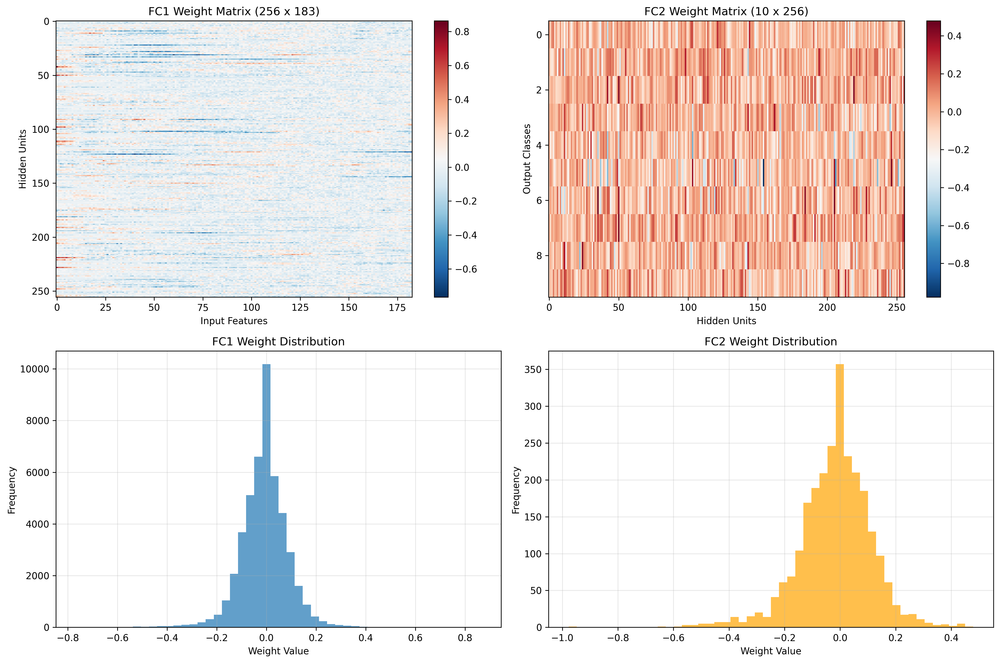

# SNN Implementation and Training

## Project Goal

The goal was to build a simple **Spiking Neural Network (SNN)** using `snntorch` to classify the preprocessed Spiking Heidelberg Digits (SHD) dataset and test if despite downsizing the original Data by a lot it was stil accurate. 

---

## SNN Architecture

For this is designed a simple two layer SNN.

**Model Layers:**

1. **Input Layer:** A fully connected layer (`self.fc1`) that takes the preprocessed input data (183 input neurons) and maps it to a hidden layer with 256 neurons. It also converts the spikes into currents through a simple linear calculation which calculates the weighted sum:

   $$I = wx+t$$

   This is necessary to transform the spike that input into the network into a current that the Leaky-Integrate-and-Fire (LIF) neuron can actually process.

2. **Hidden Layer:** A **`Leaky Integrate-and-Fire` (LIF)** neuron layer (`self.lif1`) that processes the output from the first layer. The `beta` parameter, which I had set to 0.95 controls how quickly the membrane potential decays.

3. **Output Layer:** A final fully connected layer (`self.fc2`) that converts the spikes from the LIF neurons to currents and maps it to 10 output neurons (one for each digit class (0-9)).

4. **Output LIF:** A final LIF neuron layer (`self.lif2`) to produce the final spike outputs for classification.

**Weight Initialization:** The weights for both linear layers (`fc1` and `fc2`) were initialized using the **Xavier uniform** method to make sure the starting conditions for training were good. The biases were initialized to zero.

**Forward Pass:** The forward pass iterates through each time step of the input data (total amout of 333). At each time step `t` the input `x` is fed through `fc1` and `lif1` and the resulting spikes are then passed through `fc2` and `lif2`. The spikes and membrane potentials of the final layer are recorded over all time steps.

---

## Surrogate Gradient Backpropagation

The main challenge in training SNNs is the non-differentiability of the neuron's firing mechanism and with this also the forward pass. The **LIF neuron's** output is a spike or a non-spike which is determined by a **Heaviside step function** that has a derivative of zero everywhere except at the threshold where it's undefined. Because of this standart backpropagation methods can't be used

To solve this a **surrogate gradient** is used. The idea is to replace the non-differentiable Heaviside function with a continuous differentiable surrogate function during the backpropagation. This allows the gradients to be calculated backwards through the network making it possible for the weights to be updated based on some output of the SNN.

**Forward Pass:** The firing function remains the discrete Heaviside step function:

$$S[t] = \Theta(U[t] - U_{\rm thr})$$

where $U$ is the membrane potential and $U_{th}$ is the firing threshold. The network uses this function to produce the actual spikes.

**Backward Pass:** During backpropagation the derivative of the surrogate function is used instead of the derivative of the Heaviside function. The `snntorch` library's `spike_grad` parameter handles this automatically. The derivative of the surrogate function is not zero like for the Heavyside function allowing backpropagation. The idea of using a surrogate function is bascially only a big approximation but it works great.

**Some different types Surrogate Gradient Functions:**
Here are some different surrogate functions that I tried out (These are all copied from [here](https://snntorch.readthedocs.io/en/latest/snntorch.surrogate.html)):

- **Fast Sigmoid (`snn.surrogate.fast_sigmoid`):** This is the function I ended up using because I found that it brought the best results when looking at the accuracy:

  $S ≈ \frac{U}{1 + k|U|}$
  
  $\frac{∂S}{∂U} = \frac{1}{(1+k|U|)^2}$

  

- **Arctangent (`snn.surrogate.atan`):** This is the default surrogate function used by `snntorch` if you don't specify otherwise.

  $S ≈ \frac{1}{π}\text{arctan}\left(πU \frac{α}{2}\right)$
  
  $\frac{∂S}{∂U} = \frac{1}{π}\frac{1}{\left(1+\left(πU\frac{α}{2}\right)^2\right)}$

  

- **Sigmoid (`snn.surrogate.sigmoid`):** Similar to the fast sigmoid but slower as far I know due to it using an `exp()` function

  $S ≈ \frac{1}{1 + {\rm exp}(-kU)}$
  
  $\frac{∂S}{∂U} = \frac{k{\rm exp}(-kU)}{[{\rm exp}(-kU)+1]^2}$

  

In all cases, the $k$ as well as the $\alpha$ parameter controls the steepness of the function. A steeper slope results in gradients that are closer to the actual step function's behavior but can still end up leading to worse accuracy due to it being less smooth.

---

## Training Process

The model was trained over multiple epochs and its performance was calculated by taking the accuracy both on the dataset it was training on right now as well as another independant validation set.

**Loss Function & Optimizer:** I used the standard **Cross-Entropy Loss (`nn.CrossEntropyLoss`)** to compare the total number of spikes from the output neurons against the true labels. The **Adam optimizer** was used to then update the models weights.

**Training Loop:** The `train_epoch` function handles the training logic for one epoch by iteration through the data, performing the forward pass, calculating the loss and then backpropagating the error to update the weights.

**Validation Loop:** The `validate_epoch` function should then evaluate the models performance on the validation set without updating actually updating the weights. This just done to see if there may be overfitting on the training dataset taking place

**Hyperparameter Search:** I ran the training loop for some different combinations of learning rates and epochs and also used a `StepLR` scheduler to reduce the learning rate by half every 5 epochs to try and find the optimal settings for a high accuracy 

---

## Results and Analysis

After training I looked the results by plotting the training metrics and visualizing the models weight matrices.

**Training Metrics:** I plotted how the accuracy as well as the loss changed over time:

  

**Weight Evolution:** I also plotted the weights over the epochs to see if there were any recognizable patterns forming:

  
  

  
  

