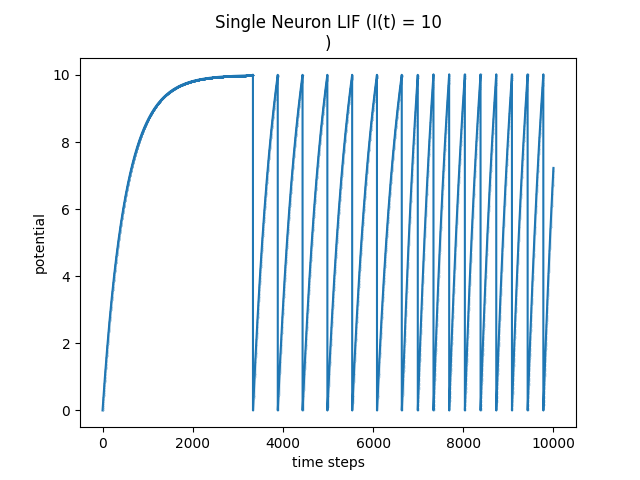

### Documenting My Leaky Integrate-and-Fire (LIF) Neuron Project

### Project Goal

Goal was to code  **Leaky Integrate-and-Fire (LIF) neuron** from scratch to understand the mechanism behind it.

---

### Implementation Details

I based my implementation on the **Forward Euler method** for solving a differential equation. This method allows me to simulate a continuous process in discrete time steps and not actually have to anlytically solve it but just numerically plot it.

I based my code and the logic behind it on a `snntorch` tutorial which i found [here](https://snntorch.readthedocs.io/en/latest/tutorials/tutorial_2.html). The tutorial outlines the following equation to calculte the membrane potential for the next time step.

$$U(t+1) = U(t) + \frac{dt}{\tau} (-U(t) + RI)$$

For actually implementing the equation i chose not realistic values to simplify the implementation for now.
In the code i set up a `starting_parameters` dictionary to hold all the neuron's key variables:
   * **Time Constant ($\tau$):** `time_constant = 500`  
   * **Potential Threshold ($U_{th}$):** `potential_threshold = 10`  
   * **Potential Reset ($U_r$):** `potantial_reset = 0`  
   * **Resistance ($R$):** `resistance = 1`  
   * **Initial Potential ($U_{in}$):** `initial_potential = 0`  

* **The Main Loop:** I used a `while` loop that runs for a set `duration` with a `dt = 1` time step. Inside this loop I perform the calculation for the membrane potential:
    1.  **Calculate Current:** I first get the current input, $I$, from my `current(t)` function. In my simulation its just a constant value while in reality as far as i know it would be used to input data into the circut and thus the SNN.
    2.  **Calculate Potential:** Next I calculate the new potential, $U(t)$.
    3.  **Check and Fire:** After updating the potential I check if `u[t-1] > u_th`. If this condition is met I set the membrane potential to the reset potential and the neuron "fires".

Once the simulation finishes I use `matplotlib` to plot the recorded `time` and `u` (membrane potential):

  

In this plot I plotted different currents at three distinct equally big time intervals.  The current for the first interval being `I = 10`, for the second `I = 15` and for the thrid `I = 20`. 

The plot shows nicely how the in the first interval the current isn't enough for the membrane potential to build up fast enough to reach the threshold. This is due to the Neuron being **leaky** and thus loosing membrane potential over time. The second and third intervals then show how the neuron reaches its threshold value faster under a higher current and how the potenital is then reset afterwards.
